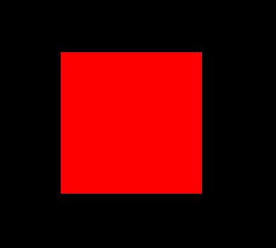
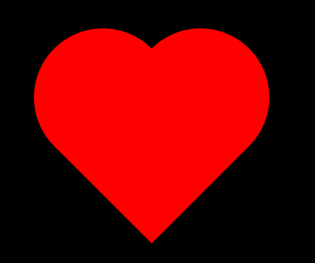

# Coração

 O desafio desse projeto, era realizar um dezenho apenas utilizando CSS. O desenho escolhido foi um coração. Ao iniciar o projeto vai ter um quadrado na tela. Ao passar o mouse sobre o quadrado, ele se tornará um coração. 

### :arrow_forward: Rodando o projeto
1. Faça o clone desse repositório.
2. Click no `index.html` presente na raíz do projeto.

### :atom_symbol: Tecnologias 
* [HTML](https://developer.mozilla.org/pt-BR/docs/Web/HTML)
* [CSS](https://developer.mozilla.org/pt-BR/docs/Web/CSS)

## :globe_with_meridians: Deploy

* https://vscd.com.br/coracao/

Para o deploy foi usado o serviço de hospedagem da hostgator.

### :desktop_computer: Previa

